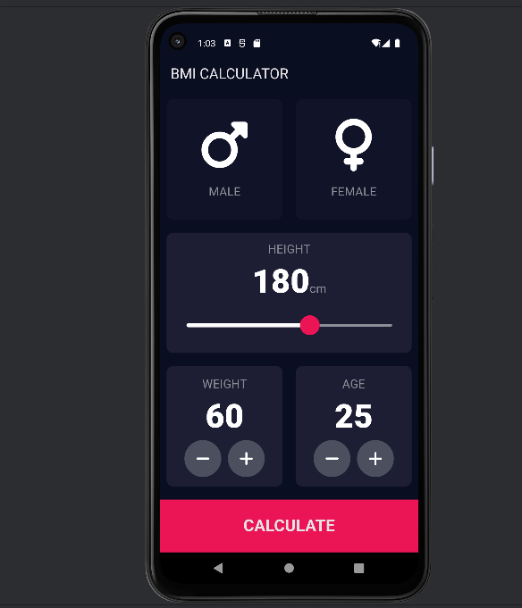
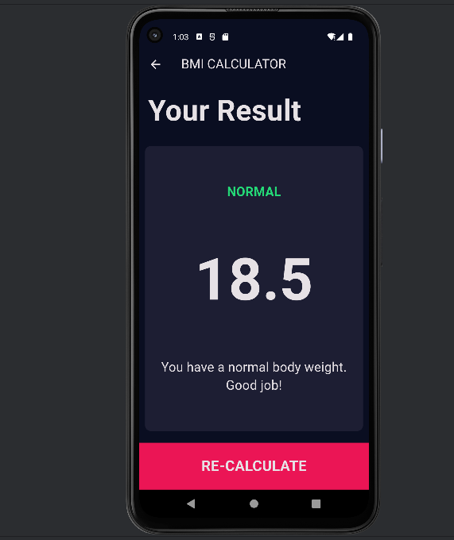

# Body Mass Index (BMI) Calculator - Flutter App

## Overview

Welcome to the Body Mass Index (BMI) Calculator Flutter app! This simple and user-friendly app allows users to calculate their BMI quickly and accurately. Whether you're on a fitness journey or just curious about your health, this app provides a convenient way to monitor your body mass index.

## Features

- **Easy-to-Use Interface**: The app offers a clean and intuitive interface, making it effortless for users to input their height and weight and obtain their BMI result.

- **BMI Calculation**: The app calculates BMI based on the user's input of height and weight, providing instant feedback on their current body mass index.

- **BMI Categories**: Users can interpret their BMI results by referring to the standard BMI categories, including underweight, normal weight, overweight, and obesity.

- **Metric and Imperial Units**: The app supports both metric and imperial units, allowing users to enter their height and weight in either centimeters/kilograms or inches/pounds.

- **Clear Results Display**: The BMI result is displayed prominently, making it easy for users to read and understand their current body mass index.

## Screenshots



*Caption: Input screen where users can enter their height and weight.*



*Caption: Results screen displaying the calculated BMI and corresponding category.*

## Getting Started

To run the BMI Calculator app, follow these steps:

1. **Clone the Repository:**
   ```bash
   https://github.com/kshubham767/bmi_calculator.git

2. **Navigate to the Project Directory:**
    ```bash
   cd bmi_calculator
3. **Install Dependencies:**
   ```bash
   flutter pub get
4. **Run the App:**
   ```bash
   flutter run

## Requirements

- Flutter SDK
- Dart

## Contributing

If you'd like to contribute to the development of the BMI Calculator app, feel free to:

- Submit pull requests
- Open issues on the GitHub repository

## License

This BMI Calculator Flutter app is licensed under the MIT License. See the [LICENSE](https://opensource.org/licenses/MIT) file for details.

## Contact
For any questions or feedback, please contact the project maintainer at kshubham767@gmail.com.

Enjoy using the BMI Calculator app! Stay healthy and fit!
